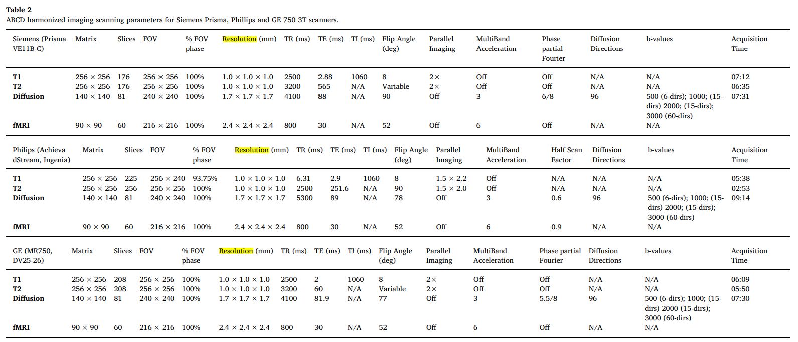
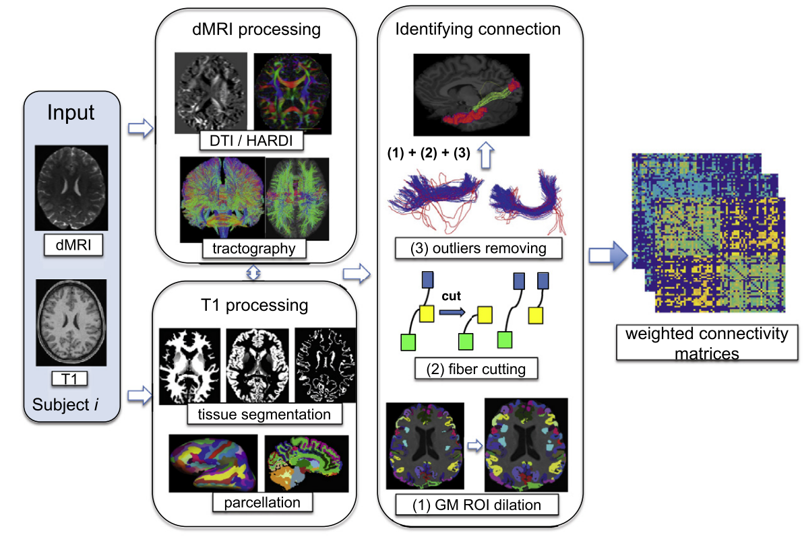

# Neuro image data and preprocessing

## ABCD imaging protocol ([paper](https://github.com/NeuroDataDesign/hyppo-2021-2022/blob/main/Yingheng_Wang/ABCD%20study%2021%20sites%20Release%202.0.pdf))

The structural T1 image was acquired with isotropic resolution of 1 $mm^3$.

The diffusion MRI image was obtained based on imaging parameters: 1.7
$mm^3$ resolution, four different b-values(𝑏 = 500, 1000, 2000, 3000) and 96 diffusion directions. There are 6 directions at 𝑏 = 500, 15 directions at 𝑏 = 1000, 15 directions at 𝑏 = 2000, 60 directions at 𝑏 = 3000. Multiband factor 3 is used for dMRI acceleration.

More details in Table below.

## Obtaining structural connectome

### Population-based structural connectome (PSC) mapping ([paper](https://github.com/NeuroDataDesign/hyppo-2021-2022/blob/main/Yingheng_Wang/Mapping%20population-based%20structural%20connectomes.pdf))

PSC uses a reproducible probabilistic tractography algorithm to generate the whole-brain tractography. This tractography method borrows anatomical information from high-resolution T1-weighted imaging to reduce bias in reconstruction of tractography.

Pipeline is shown in Figure below.

